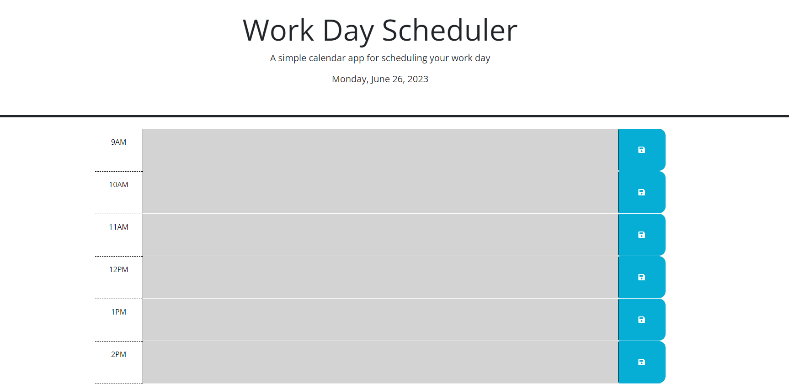
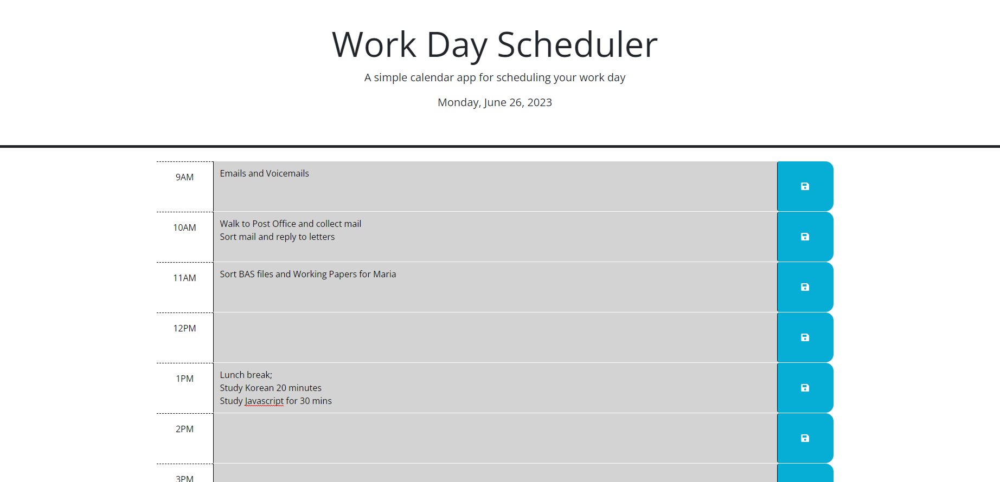

# Secure Password Generator

This week required modification a starter code to create an application that allows a user to save events for each hour of a typical working day.

I was given HTML and CSS to begin with however had to create the JavaScript. 
The code I have created, runs along side of the CSS and HTML. I have also been tasked to use the Day.js library to work with dates and times.

When you open the planner, the current day is displayed at the top of the calendar, with timeblocks for standard business hours of 9am - 5pm. Each timeblock is color coded to indicate whether it is in the past, present, or future. With the use of local storage when you enter an event into the time block and click save the events will persist and retain the information.

## Screenshots

## Link to Deployed Application

https://shs-peb.github.io/Work-Day-Scheduler/
